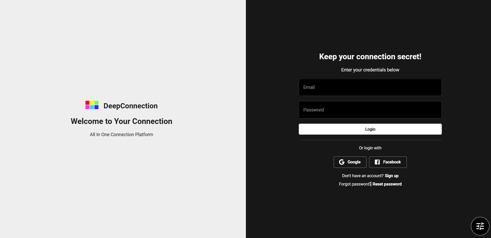

# Deepconnection : all in 1 insightful connection management 

## Features
1. User can collect information about people who they deal with or know such as profile, goal, deal, conversation and map relationship among their profile to know insight their relationship.
2. Track user connections on the dashboard to summarize total transactions, total connections, and total profit, displaying the information through specific bars on the dashboard.
3. Users can save numerous conversations about their connections, hidden strategies that few others know.

### How to run it locally 
### 1. `npm run dev` for frontend and cd backend then run `python manage.py runserver` for backend
### 2. run docker image both frontend and backend 
### 3. docker-compose up for running docker to use Grafana, Prometheus, loki and promtail 

